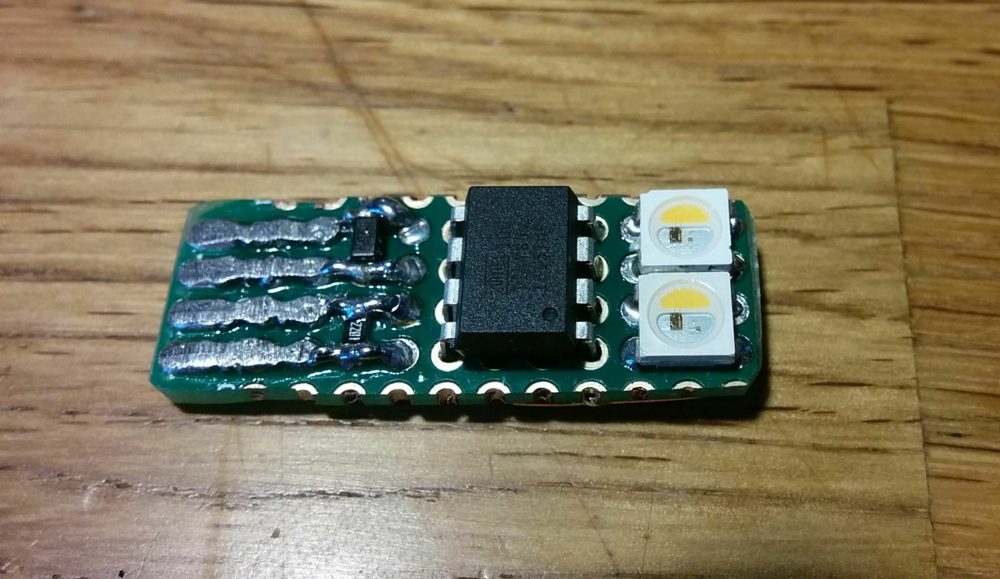
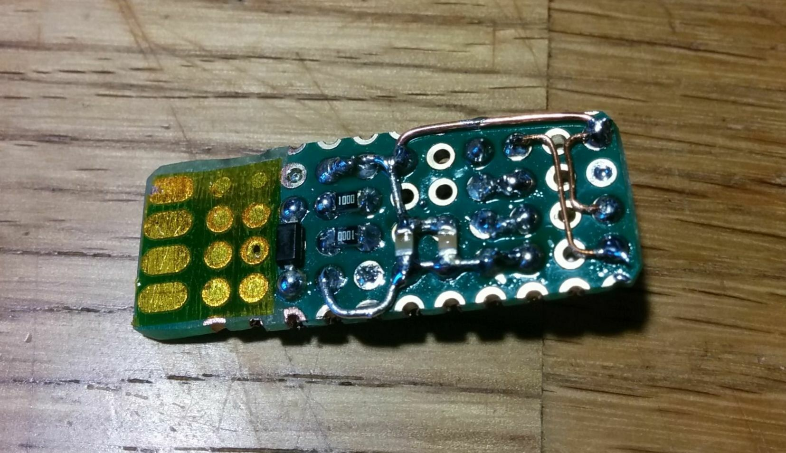
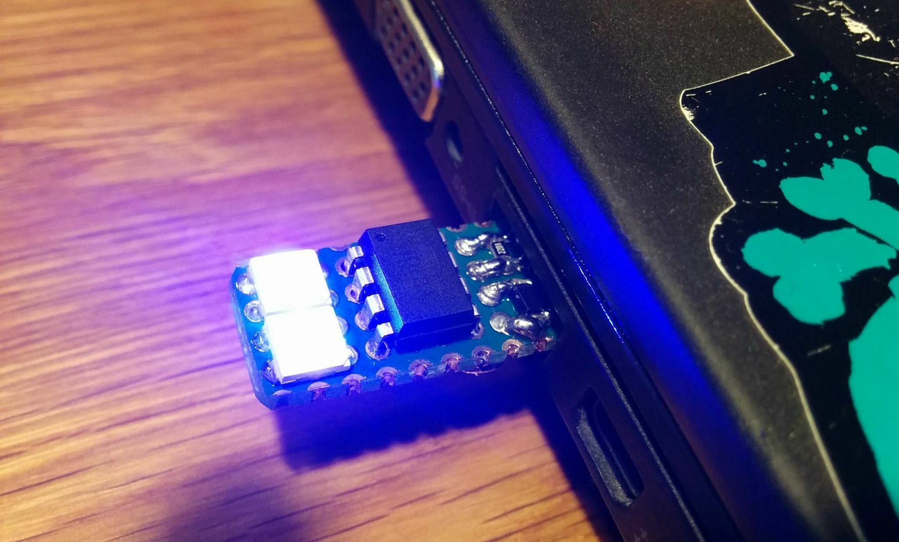

# usbpixel

This was a small project to test the V-USB stack on an ATtiny85 microcontroller.
Needing something "useful" to control, I chose two NeoPixel LEDS that are connected
in series.

There is no schematics because I wired everything on a piece of protoboard .. even the
USB connector itself is a sketchy result of sanding down four large solder bridges.
I definitely wouldn't recommend this approach if you like your host's USB bus but
it *works for me*™.







## Installation

### Bootloader

I'm using the micronucleus bootloader here. The initial flash must happen with
clips or by using a dedicated programmer socket for the ATtiny85. After you've verified
that the bootloader works and can speak to your host via USB, you can flash programs
simply by re-plugging the usbpixel.

The `bootloader/` directory contains a configuration that must be linked or copied
into a checked out micronucleus repository.

```
cd $MICRONUCLEUS/firmware/
ln -s $USBPIXEL/bootloader configuration/usbpixel
make CONFIG=usbpixel
```

### Firmware

The firmware is a PlatformIO project. Simply build and upload the firmware with `pio` –
the tool will block and wait until it sees a micronucleus device on the USB bus. The bootloader
above is configured to always enter the bootloader on boot, so you just need to re-plug the usbpixel
into your USB port.

**Note:** You may need to fix the micronucleus tool used by PlatformIO first, see
[platformio/platform-atmelavr#101](https://github.com/platformio/platform-atmelavr/issues/101).


```
cd $USBPIXEL/firmware
pio run -t upload
```

### Commandline Tool

In order to interface with the usbpixel I've written a small tool using Google's `google/gousb`,
which wraps `libusb`. It is a pretty minimal example showing how easy it is to use the different
control messages.

```
cd $USBPIXEL/cli
go build -o usbpixel
```

Check the `-help` command for available commands.

```
./usbpixel -help
```
